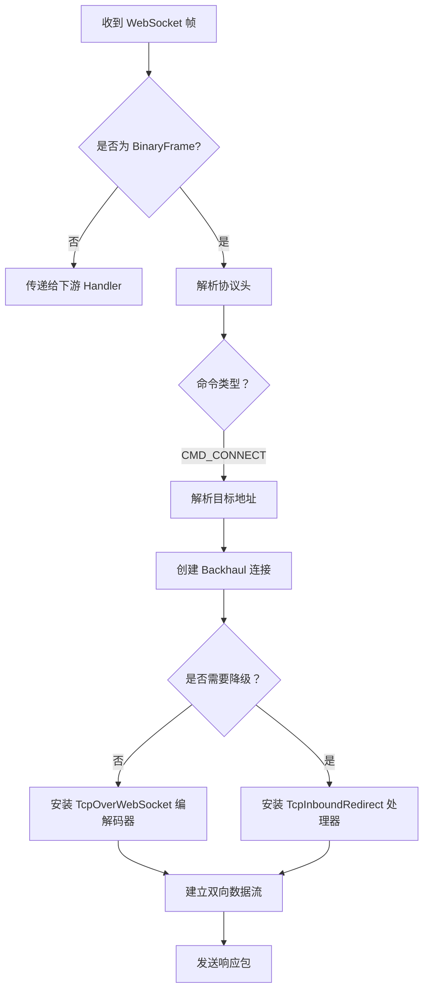

# Pangolin Agent 架构文档

## 📋 概述

Pangolin Agent 是一个基于 WebSocket 的隧道代理系统，支持双向 TCP 流量转发。该系统采用 Netty 作为网络通信框架，实现了高效的异步 I/O 处理能力。

### 模块结构

```
pangolin/
├── pangolin-agent           # 核心代理库（可独立使用）
└── pangolin-agent-app       # Spring Boot 应用封装
```

---

## 🏗️ 架构设计

### 设计理念

1. **职责分离**：核心代理逻辑与应用封装解耦
2. **双模式支持**：主动连接 + 被动接收
3. **协议降级**：根据网络状况动态切换传输模式
4. **异步非阻塞**：基于 Netty EventLoop 实现高并发

### 技术栈

- **Java 11**
- **Netty 4.x**（网络通信框架）
- **WebSocket API (JSR-356)**（WebSocket 标准实现）
- **Servlet 3.1+**（Web 容器支持）
- **Spring Boot 2.0**（应用封装）
- **Lombok**（代码简化）

---

## 📦 模块一：pangolin-agent（核心代理库）

### 功能定位

提供 WebSocket 隧道代理的核心实现，可作为库嵌入到其他应用中使用。

### 类结构

```
📦 pangolin-agent
├── 🔹 WebSocketBridgeAgent          # 代理主控制器
├── 🔹 WebSocketBridgeAgentHandler   # WebSocket 消息处理器
├── 🔹 WebSocketBridgeAgentLauncher  # 代理启动器
├── 📂 servlet
│   ├── 🔹 WebSocketBridgeEndpoint      # WebSocket 服务端点 (JSR-356)
│   └── 🔹 WebSocketEndpointLoaderListener # Endpoint 注册监听器
└── 📂 util
    └── 🔹 Channels2                    # 通道工具类
```

### 核心组件详解

#### 1️⃣ WebSocketBridgeAgent

**文件路径**: `src/main/java/com/github/pangolin/agent/WebSocketBridgeAgent.java`

**职责**: 管理 WebSocket 连接生命周期

**核心方法**:

| 方法 | 说明 |
|------|------|
| `connect()` | 创建到服务器的 WebSocket 连接 |
| `start()` | 启动代理服务（幂等控制） |
| `shutdownGracefully()` | 优雅关闭连接和资源 |
| `isRunning()` | 检查运行状态 |

**握手协议头配置**:
```java
// 节点信息上报
X-Node-Name: <节点名称>
X-Node-Version: 1.2
X-Node-Intranet: <内网地址>
Authorization: Bearer <Base64Token>
```

**Token 生成逻辑**:
```
VER_1 (1 byte) 
+ 0xFF(1 byte) + 0x00(1 byte)
+ ATYPE_DOMAIN(1 byte) + 域名长度 (1 byte) + 域名
+ 端口 (2 bytes)
+ 节点名长度 (1 byte) + 节点名
+ 版本号长度 (1 byte) + 版本号
→ Base64 URL-SAFE 编码
```

**状态管理**:
- 使用 `AtomicBoolean` 保证启动的原子性
- 使用 `ChannelFuture` 跟踪连接状态
- 支持断线自动重连机制

---

#### 2️⃣ WebSocketBridgeAgentHandler

**文件路径**: `src/main/java/com/github/pangolin/agent/WebSocketBridgeAgentHandler.java`

**继承**: `SimpleChannelInboundHandler<WebSocketFrame>`

**协议定义**:

```java
// 命令类型
CMD_CONNECT = 0x01  // 建立 TCP 连接

// 地址类型
ATYPE_IPv4 = 0x01   // IPv4 地址（4 字节）
ATYPE_DOMAIN = 0x03 // 域名（变长）
ATYPE_IPv6 = 0x04   // IPv6 地址（16 字节）

// 响应状态码
REPLY_SUCCESS = 0x00           // 成功
REPLY_FAILURE = 0x01           // 失败
REPLY_NETWORK_UNREACHABLE = 0x03  // 网络不可达
REPLY_HOST_UNREACHABLE = 0x04     // 主机不可达
REPLY_CONNECTION_REFUSED = 0x05   // 连接被拒绝
```

**消息格式**:

**请求包结构**:
```
┌─────────┬────────────┬──────────┬─────────┬──────────────┐
| Version | ID (varint)| Command  | RSV     | Address Info │
| 1 byte  | 1 byte+len | 1 byte   | 1 byte  | variable     │
└─────────┴────────────┴──────────┴─────────┴──────────────┘

Address Info:
┌──────────┬─────────────────┬──────────┐
| AddrType | Address (varlen)| Port     │
| 1 byte   | 1 byte len + data| 2 bytes │
└──────────┴─────────────────┴──────────┘
```

**响应包结构**:
```
┌─────────┬────────────┬──────────┬─────────┬──────────────┐
| Version | ID (varint)| Status   | RSV     | Address Info │
| 1 byte  | 1 byte+len | 1 byte   | 1 byte  | variable     │
└─────────┴────────────┴──────────┴─────────┴──────────────┘
```

**工作流程**:



**状态机**:
```java
enum State {
    SUSPENDED,     // 未连接
    INITIALIZING,  // 握手中
    INITIALIZED    // 已就绪
}
```

**心跳机制**:
- 空闲检测：600 秒无活动触发
- 自动发送 Ping 帧保活
- 超时自动重连

---

#### 3️⃣ Channels2

**文件路径**: `src/main/java/com/github/pangolin/agent/util/Channels2.java`

**职责**: WebSocket 通道工厂类

**核心方法**: `openWs()`

**协议栈配置**:
```
SocketChannel
├── SslContext (可选，wss:// 支持)
├── HttpClientCodec
├── HttpObjectAggregator (8MB)
├── WebSocketClientProtocolHandler
├── FlowControlHandler (流量控制)
└── BusinessHandler (业务处理器)
```

**特性**:
- 自动识别 `ws://` 和 `wss://` 协议
- SSL/TLS 上下文自动配置
- HTTP 消息聚合优化
- 流量控制防止内存溢出

---

#### 4️⃣ WebSocketBridgeEndpoint

**文件路径**: `src/main/java/com/github/pangolin/agent/servlet/WebSocketBridgeEndpoint.java`

**注解**: `@ServerEndpoint("/ws/bridge/{tunnelKey}")`

**工作模式**: Servlet 容器模式（被动接收连接）

**生命周期方法**:

| 注解 | 方法 | 说明 |
|------|------|------|
| `@OnOpen` | `onOpen()` | 处理新连接，验证 Token，建立 TCP 转发 |
| `@OnClose` | `onClose()` | 清理资源，关闭下游连接 |
| `@OnMessage` | `onMessage()` | 接收 WebSocket 数据，转发到 TCP 通道 |

**认证流程**:
```java
1. 从 URL 参数获取 access_token
2. Base64 URL-SAFE 解码
3. 验证协议版本（当前：0x01）
4. 验证命令类型（必须为 CMD_CONNECT）
5. 解析目标地址和端口
6. 验证隧道密钥（tunnelKey）
7. 建立到目标的 TCP 连接
```

**数据转发**:
```
WebSocket Session ←→ ByteBuf → Netty Channel → Target
Netty Channel ←→ ByteBuf → WebSocket Session.sendBinary()
```

**访问控制**:
```java
// 默认 Access Key（可通过系统属性覆盖）
websocket.bridge.access_key = c254dacd0cde3be75ac2988f691ec105
```

---

#### 5️⃣ WebSocketEndpointLoaderListener

**文件路径**: `src/main/java/com/github/pangolin/agent/servlet/WebSocketEndpointLoaderListener.java`

**接口**: `ServletContextListener`

**功能**:
- Web 应用启动时自动注册 WebSocket Endpoint
- 检测容器是否支持 JSR-356 WebSocket
- 自定义端点配置（解码器、编码器、子协议）

**注册流程**:
```java
contextInitialized()
  ├─ 获取 ServerContainer
  ├─ 扫描 @ServerEndpoint 注解的类
  ├─ 创建 ServerEndpointConfig
  ├─ 调用 Configurator.customize()
  └─ 部署到容器
```

---

## 📦 模块二：pangolin-agent-app（Spring Boot 应用）

### 功能定位

将 `pangolin-agent` 封装为可独立运行的 Spring Boot 应用，提供完整的运行时环境。

### 依赖架构

```xml
pangolin-agent-app
├── pangolin-agent              # 核心代理库
├── pangolin-common             # 通用处理器
├── pangolin-client-spring-boot-starter  # 客户端 Starter
├── spring-boot-starter-web     # Web 支持
├── netty-*                     # Netty 组件
├── zookeeper                   # 服务发现
└── guava                       # 工具库
```

### 配置文件

**文件**: `src/main/resources/application.yaml`

```yaml
spring:
  application:
    name: pangolin-agent
  management:
    tunnel: ws://127.0.0.1:2345/tunnel  # 隧道服务器地址
```

### 启动类

**文件**: `src/main/java/com/github/pangolin/agent/WebSocketBridgeAgentApplication.java`

```java
@SpringBootApplication
public class WebSocketBridgeAgentApplication {
    public static void main(String[] args) throws Exception {
        SpringApplication.run(WebSocketBridgeAgentApplication.class, args);
        // 可通过系统参数配置：
        // -Dagent.name=<节点名>
        // -Dagent.server=<ws 地址>
    }
}
```

### 打包方式

使用 Spring Boot Maven Plugin 生成可执行 JAR：
```bash
mvn clean package
java -jar target/pangolin-agent-app-0.0.5-SNAPSHOT.jar
```

---

## 🔄 通信协议详解

### 1. Agent 连接协议

**握手阶段协议头**:

| 字段 | 类型 | 说明 |
|------|------|------|
| X-Node-Name | String | 节点名称标识 |
| X-Node-Version | String | 协议版本（当前：1.2） |
| X-Node-Intranet | String | 内网 IP 地址 |
| Authorization | Bearer Token | 认证令牌 |

**Token 载荷结构** (Base64 编码前):
```
┌──────┬────────┬────────┬──────────┬─────────────────┬───────┐
| VER  | Flag1  | Flag2  | AddrType | Address + Port  | ...   │
| 0x01 | 0xFF   | 0x00   | 0x03     | variable        | node  │
└──────┴────────┴────────┴──────────┴─────────────────┴───────┘
         续：
┌──────────┬──────────┬─────────────────┬──────────┬──────────┐
| version  | NodeName | NodeVersion     | ...      | Checksum?│
| length   | length   | version length  |          |          │
└──────────┴──────────┴─────────────────┴──────────┴──────────┘
```

### 2. 连接建立协议

**请求格式** (Agent → Server):
```
┌──────┬───────────┬─────────┬─────┬──────────┬──────────────┐
| VER  | ID Length | Command | RSV | AddrType | Address Data │
| 0x01 | 1 byte    | 0x01    | 0/1 | 1 byte   | variable     │
└──────┴───────────┴─────────┴─────┴──────────┴──────────────┘
         续：
┌──────────┬───────┐
| Port     | Padding|
| 2 bytes  | ...   │
└──────────┴───────┘
```

**响应格式** (Server → Agent):
```
┌──────┬───────────┬────────┬─────┬──────────┬──────────────┐
| VER  | ID Length | Status | RSV | AddrType | Address Data │
| 0x01 | 1 byte    | 1 byte | 0/1 | 1 byte   | 4 bytes      │
└──────┴───────────┴────────┴─────┴──────────┴──────────────┘
         续：
┌──────────┐
| Port     │
| 2 bytes  │
└──────────┘
```

**状态码枚举**:
```java
0x00 - REPLY_SUCCESS          // 成功
0x01 - REPLY_FAILURE          // 一般性失败
0x02 - REPLY_FORBIDDEN        // 禁止访问
0x03 - REPLY_NETWORK_UNREACHABLE  // 网络不可达
0x04 - REPLY_HOST_UNREACHABLE     // 主机不可达
0x05 - REPLY_CONNECTION_REFUSED   // 连接被拒绝
0x06 - REPLY_TTL_EXPIRED          // TTL 过期
0x07 - REPLY_COMMAND_UNSUPPORTED  // 不支持的命令
0x08 - REPLY_ADDRESS_UNSUPPORTED  // 不支持的地址类型
```

### 3. 数据传输模式

#### 模式 A: 标准模式（WebSocket 封装）

```
TCP Data → TcpOverWebSocketEncodeHandler → BinaryWebSocketFrame
BinaryWebSocketFrame → TcpOverWebSocketDecodeHandler → TCP Data
```

**特点**:
- 保留 WebSocket 协议层
- 支持控制帧（Ping/Pong/Close）
- 适合复杂网络环境

#### 模式 B: 降级模式（纯 TCP 转发）

```
TCP Data → TcpInboundRedirectHandler → TCP Data
```

**触发条件**: `rsv != 0`

**特点**:
- 移除 WebSocket 协议开销
- 直接字节流转发
- 性能更优，适合可信网络

---

## 🎯 核心数据流

### 场景 1: Agent 主动连接模式

```mermaid
sequenceDiagram
    participant A as Agent
    participant S as Server
    participant T as Target
    
    A->>S: WebSocket 连接（携带 Token）
    S->>A: 握手成功
    S->>A: CMD_CONNECT (目标地址)
    A->>T: 建立 TCP 连接
    A-->>S: 响应（状态码）
    
    Note over A,S,T: 双向数据转发开始
    
    loop 数据传输
        S->>A: WebSocket Binary Frame
        A->>T: TCP Data
        T->>A: TCP Data
        A->>S: WebSocket Binary Frame
    end
    
    S->>A: Close Frame
    A->>T: 关闭 TCP 连接
    A->>S: 关闭 WebSocket
```

### 场景 2: Servlet 被动接收模式

```mermaid
sequenceDiagram
    participant C as Client
    participant E as WebSocketEndpoint
    participant T as Target
    
    C->>E: WebSocket 连接 (/ws/bridge/{tunnelKey}?access_token=xxx)
    E->>E: 验证 Token
    E->>E: 解析目标地址
    E->>T: 建立 TCP 连接
    
    Note over C,E,T: 双向数据转发开始
    
    loop 数据传输
        C->>E: WebSocket Binary Frame
        E->>T: TCP Data
        T->>E: TCP Data
        E->>C: WebSocket Binary Frame
    end
```

---

## 🔧 关键技术特性

### 1. 异步 I/O 模型

- **EventLoopGroup**: NioEventLoopGroup 管理所有通道
- **单线程事件循环**: 每个连接使用一个 EventLoop
- **无锁串行化**: 同一连接的所有操作在同一线程执行

### 2. 流量控制

```java
pipeline.addLast(new FlowControlHandler());
```

**作用**:
- 自动调节 `channel.config().setAutoRead()`
- 防止 FastWriter 导致 OOM
- 背压（Backpressure）机制

### 3. 连接管理

**优雅关闭**:
```java
channelFuture.channel().closeFuture()
    .addListener(f -> workerGroup.shutdownGracefully());
```

**资源释放**:
- Channel 关闭时自动释放 ByteBuf
- EventLoopGroup 优雅终止
- Session 关闭触发清理回调

### 4. 心跳保活

```java
new IdleStateHandler(600, 600, 600)
```

**机制**:
- 读空闲：600 秒无读操作
- 写空闲：600 秒无写操作
- 全空闲：600 秒无任何活动
- 触发事件：发送 PingWebSocketFrame

### 5. 协议降级

**判断条件**:
```java
boolean downgrade = (rsv != 0);
```

**降级处理**:
```java
if (!downgrade) {
    // 标准模式：TcpOverWebSocket 编解码器
    pipeline.replace(..., new TcpOverWebSocketEncodeHandler(...));
} else {
    // 降级模式：纯 TCP 转发
    pipeline.replace(..., new TcpInboundRedirectHandler(...));
    // 移除 WebSocket 协议层
    pipeline.remove(Utf8FrameValidator.class);
    pipeline.remove("wsencoder");
    pipeline.remove("wsdecoder");
}
```

### 6. 错误传播

```java
private static ChannelFutureListener propagationOnFailure(final Promise<?> promise) {
    return future -> {
        if (!future.isSuccess()) {
            promise.tryFailure(future.cause());
        }
    };
}
```

**特性**:
- 级联失败通知
- 异常原因传递
- 资源清理保障

---

## 📊 模块对比

| 特性维度 | pangolin-agent | pangolin-agent-app |
|---------|----------------|--------------------|
| **产品形态** | Java 类库 | 可执行应用 |
| **运行方式** | 嵌入式集成 | 独立进程 |
| **配置方式** | 编程式 API | YAML 配置文件 |
| **依赖框架** | Netty + WebSocket API | Spring Boot + ZooKeeper |
| **扩展能力** | 需自行开发 | 支持 Spring 生态 |
| **部署复杂度** | 低（JAR 依赖） | 中（需 JVM 环境） |
| **适用场景** | 集成到现有系统 | 独立代理服务部署 |
| **可观测性** | 需自行集成 | 内置 Actuator 支持 |

---

## 🚀 使用示例

### 方式 1: 作为库使用

```java
public class MyAgentApp {
    public static void main(String[] args) throws Exception {
        WebSocketBridgeAgent agent = new WebSocketBridgeAgent(
            "MyNode", 
            URI.create("ws://server:2345/tunnel/123")
        );
        
        agent.start();
        
        // 等待退出信号
        Runtime.getRuntime().addShutdownHook(new Thread(() -> {
            agent.shutdownGracefully();
        }));
    }
}
```

### 方式 2: 使用 Launcher

```java
public class QuickStart {
    public static void main(String[] args) throws Exception {
        WebSocketBridgeAgentLauncher launcher = new WebSocketBridgeAgentLauncher();
        launcher.launchIfNecessary(
            "LocalNode", 
            "ws://localhost:2345/tunnel/123"
        );
    }
}
```

### 方式 3: Spring Boot 应用

```bash
# 配置文件方式
java -jar pangolin-agent-app.jar \
  --spring.management.tunnel=ws://127.0.0.1:2345/tunnel

# 或系统参数方式
java -jar pangolin-agent-app.jar \
  -Dagent.name=ProductionNode \
  -Dagent.server=ws://prod-server:2345/tunnel/456
```

---

## 🔒 安全考虑

### 认证机制

1. **Token 认证**: Base64 编码的连接信息 + 签名
2. **Access Key**: 隧道级别的访问密钥
3. **节点信息绑定**: X-Node-Name 防伪造

### 建议增强

- [ ] Token 添加 HMAC 签名
- [ ] 支持 TLS 双向认证
- [ ] 实现 IP 白名单
- [ ] 添加速率限制
- [ ] 审计日志记录

---

## 📈 性能优化方向

### 已知优化点

1. **零拷贝**: 使用 `ByteBuf` 直接传递，避免内存复制
2. **对象池**: ByteBuf 池化复用
3. **批量聚合**: HttpObjectAggregator 减少系统调用
4. **流量控制**: FlowControlHandler 防止内存溢出
5. **协议降级**: 在可信网络使用纯 TCP 转发

### 待优化项

- [ ] 连接池管理（针对高频短连接）
- [ ] 压缩支持（针对文本数据）
- [ ] 多路复用（单 WebSocket 多 TCP 流）
- [ ] 监控指标（Micrometer 集成）
- [ ] 分布式追踪（Sleuth/Zipkin）

---

## 🐛 故障排查

### 常见问题

#### 1. 连接建立失败

**症状**: Agent 无法连接到 Server

**排查步骤**:
```bash
# 检查网络连通性
telnet server 2345

# 检查 WebSocket 路径
curl -i -H "Upgrade: websocket" -H "Connection: Upgrade" \
  http://server:2345/tunnel/123

# 查看日志
tail -f logs/pangolin.log | grep "WebSocket"
```

#### 2. Token 验证失败

**症状**: 401 Unauthorized

**可能原因**:
- Token 过期
- 节点信息不匹配
- Access Key 配置错误

**解决方法**:
```properties
# 检查系统属性
-Dwebsocket.bridge.access_key=<正确的密钥>
```

#### 3. 数据传输中断

**症状**: 连接建立后无数据流

**可能原因**:
- 流量控制触发
- 对端未设置 autoRead=true
- 背压机制阻塞

**调试方法**:
```java
// 启用详细日志
-Dio.netty.leakDetection.level=PARANOID
-Dorg.slf4j.simpleLogger.log.io.netty=debug
```

---

## 📝 开发指南

### 扩展 Handler

```java
public class CustomAgentHandler extends SimpleChannelInboundHandler<WebSocketFrame> {
    @Override
    protected void channelRead0(ChannelHandlerContext ctx, WebSocketFrame frame) {
        // 自定义消息处理逻辑
    }
    
    @Override
    public void userEventTriggered(ChannelHandlerContext ctx, Object evt) {
        if (evt instanceof IdleStateEvent) {
            // 自定义心跳处理
        }
    }
}
```

### 自定义 Endpoint

```java
@ServerEndpoint("/ws/custom/{param}")
public class CustomWebSocketEndpoint {
    @OnOpen
    public void onOpen(@PathParam("param") String param, Session session) {
        // 自定义连接逻辑
    }
}
```

---

## 🔮 未来规划

### 短期目标 (v1.3)

- [ ] 支持 SOCKS5 代理协议
- [ ] 添加连接统计指标
- [ ] 实现动态配置热更新
- [ ] 支持集群模式

### 中期目标 (v2.0)

- [ ] QUIC 协议支持
- [ ] gRPC over WebSocket
- [ ] 服务网格集成
- [ ] 可视化监控面板

### 长期愿景

- 云原生代理网关
- 零信任网络架构
- 智能路由决策
- 自适应流量调度

---

## 📚 参考资料

- [Netty 官方文档](https://netty.io/wiki/)
- [JSR-356 WebSocket API](https://javaee.github.io/websocket-spec/)
- [Spring Boot 参考指南](https://spring.io/projects/spring-boot)
- [RFC 6455 WebSocket Protocol](https://tools.ietf.org/html/rfc6455)

---

## 📄 版本历史

| 版本 | 日期 | 变更说明 |
|------|------|----------|
| 0.0.5-SNAPSHOT | 2026-04-03 | 当前开发版本 |
| 1.2 | - | 当前协议版本 |
| 1.1 | - | 初始稳定版本 |

---

*最后更新：2026-04-03*  
*维护者：Pangolin Team*
