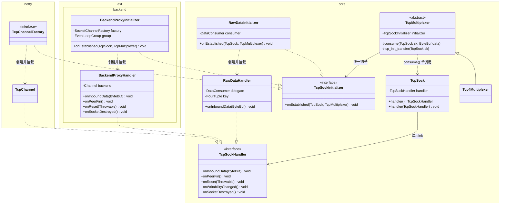
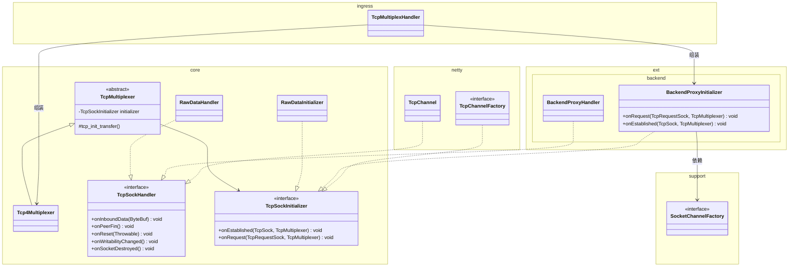

# v2 TCP 钩子层改造:P1 / P2 类图

> 背景:v2 TCP 栈在 `TcpMultiplexer#consume` 中硬编码了三条入站 sink 分支(`UserChannelBridge` →
> `backendChannel` → `DataConsumer`),并且 `Tcp4Multiplexer` 在 `core` 包内直接依赖
> `SocketChannelFactory` / `TcpChannelFactory`。本文为后续的两步解耦改造落一版类图与迁移路径。
>
> - **P1**:把三条 sink 统一到一个接口(重命名为 `TcpSockHandler`),消除 `TcpMultiplexer#consume`
>   的多分支;同时接口 `UserChannelInitializer` 重命名为 `TcpSockInitializer`。
> - **P2**:让 `core` 包脱离对 `SocketChannelFactory` / `TcpChannelFactory` 的直接依赖,
>   backend 透传模式沉到一个独立的 `BackendProxyInitializer` 实现中。
>
> 两阶段独立、可分开合入;P1 不依赖 P2,但 P2 建议在 P1 之后做,避免二次搬动。
>
> **命名约定**:§一 AS-IS 节保留旧名 `UserChannelInitializer` / `UserChannelBridge`
> 以匹配当前代码;§二起的目标态一律使用新名 `TcpSockInitializer` / `TcpSockHandler`。

---

## 一、AS-IS:当前钩子拓扑

```mermaid
classDiagram
    namespace core {
        class TcpMultiplexer {
            <<abstract>>
            -DataConsumer dataConsumer
            -UserChannelInitializer userChannelInitializer
            #consume(TcpSock sk, ByteBuf data)
            #tcp_init_transfer(TcpSock sk)
        }
        class TcpSock {
            -Channel childChannel
            -UserChannelBridge userChannelBridge
            +hasBackendChannel() boolean
            +childChannel() Channel
            +userChannelBridge() UserChannelBridge
        }
        class UserChannelBridge {
            <<interface>>
            +onInboundData(ByteBuf) void
            +onPeerFin() void
            +onReset(Throwable) void
            +onWritabilityChanged() void
            +onSocketDestroyed() void
        }
        class UserChannelInitializer {
            <<interface>>
            +onEstablished(TcpSock, TcpMultiplexer) void
        }
        class DataConsumer {
            <<interface>>
            +onData(FourTuple, ByteBuf) void
        }
        class Tcp4Multiplexer {
            -SocketChannelFactory socketChannelFactory
            -EventLoopGroup childGroup
            #tcp_v4_conn_request(...)
            -startHandshake(...)
        }
    }
    namespace netty {
        class TcpChannelFactory {
            <<interface>>
            +create(TcpSock, TcpMultiplexer) TcpChannel
            +onEstablished(TcpSock, TcpMultiplexer) void
        }
        class TcpChannel {
            -UserChannelBridge bridge
        }
    }
    namespace support {
        class SocketChannelFactory {
            <<interface>>
            +open(InetSocketAddress, int, boolean, EventLoopGroup, ChannelHandler) ChannelFuture
        }
    }

    TcpMultiplexer <|-- Tcp4Multiplexer
    TcpMultiplexer --> DataConsumer : sink #3
    TcpMultiplexer --> UserChannelInitializer : 建连钩子
    TcpMultiplexer ..> TcpSock : consume() 三分支分流
    TcpSock --> UserChannelBridge : sink #1
    TcpSock --> "Channel" : sink #2 backendChannel
    TcpChannelFactory ..|> UserChannelInitializer
    TcpChannelFactory ..> TcpChannel : 创建
    TcpChannel ..|> UserChannelBridge : 内部实现
    Tcp4Multiplexer --> SocketChannelFactory : 打开 backend
    Tcp4Multiplexer --> TcpChannelFactory : UserChannelInitializer 实现
```

**痛点**

1. `TcpMultiplexer#consume` 三路 `if/else`,新增 sink(如 SOCKS 出站、桥接到 raw UDP)要改 core。
2. `core` 直接依赖 `support.SocketChannelFactory`,`core` 不再是"纯协议栈",也不能单独抽成
   jar 给其它项目复用。
3. backend 透传逻辑混在 `Tcp4Multiplexer#startHandshake` 里,握手流程和业务 sink 耦合,测试
   需要真 socket。
4. `TcpSock` 同时持有 `childChannel`(backend)和 `userChannelBridge`,字段重复、语义重叠。

---

## 二、P1 类图:统一 Sink(`TcpSockHandler` 作为唯一 sink 接口)

### 命名约定

P1 合入时同步重命名(本节及后文一律使用新名):

| 现名 | 新名 | 语义 |
|---|---|---|
| `UserChannelInitializer` | **`TcpSockInitializer`** | 挂在 `TcpSock` 上的一次性建连装配钩子 |
| `UserChannelBridge` | **`TcpSockHandler`** | 挂在 `TcpSock` 上的长期事件回调处理器(对齐 Linux `sk->sk_user_data` 思路) |
| `UserChannelBridge` 的实现类 `*Bridge` | **`*Handler`** | 配套改名:`RawDataHandler` / `BackendProxyHandler` |
| `TcpSock#userChannelBridge` 字段 | **`TcpSock#handler`** | 访问器 `handler()` / `handler(TcpSockHandler)` |

**不取 `TcpChannel*` 命名的原因**:
1. `TcpChannel` 是 `netty` 子包已存在的具体类,接口在 `core` 包却以下游具体类命名,暗示循环依赖。
2. P1 后有三个实现(`TcpChannelFactory` / `RawDataInitializer` / `BackendProxyInitializer`),
   其中两个不创建 `TcpChannel`,名字会误导。
3. `TcpChannelHandler` 容易与 Netty `ChannelHandler` 混淆,但接口不走 pipeline,是 sock 级 1:1 挂载。

**兼容性**:现有 `TcpChannelFactory`(netty 子包)名字保留,继续作为 `TcpSockInitializer` 的子接口使用。

### 核心结论

- `TcpSock` 只保留 **一个** sink 字段:`TcpSockHandler handler`。
- `DataConsumer` 降级为 `TcpSockHandler` 的一个平凡实现(`RawDataHandler`),由 initializer
  在建立连接时注入。
- backend 透传也变成 `TcpSockHandler` 的一个实现(`BackendProxyHandler`),通过
  `BackendProxyInitializer` 在 `tcp_init_transfer` 时挂入。
- `TcpMultiplexer#consume` 退化为 `sk.handler().onInboundData(data)` 一行。



### P1 的改动清单(只改 pangolin-routing)

| # | 动作 | 位置 | 说明 |
|---|------|------|------|
| 1 | 重命名接口 | `core` 包 | `UserChannelInitializer` → `TcpSockInitializer`;`UserChannelBridge` → `TcpSockHandler`。 |
| 2 | 重命名字段 / 访问器 | `TcpSock` | `userChannelBridge` → `handler`;`userChannelBridge(x)` → `handler(x)`。 |
| 3 | 新增 `RawDataHandler implements TcpSockHandler` | `core` 包 | 内部封装 `DataConsumer` + `FourTuple`,`onInboundData` 转发;其它回调 no-op。 |
| 4 | 新增 `RawDataInitializer implements TcpSockInitializer` | `core` 包 | 在 `onEstablished` 里 `sk.handler(new RawDataHandler(consumer, sk.fourTuple()))`。 |
| 5 | 把 `BackendProxyHandler` + `BackendProxyInitializer` 抽出 | `ext.backend` 包(新建) | 封装原 `Tcp4Multiplexer#startHandshake` 的 backend 连接 + 透传逻辑。 |
| 6 | `TcpMultiplexer#consume` 简化 | `TcpMultiplexer` | 只保留 `sk.handler().onInboundData(data)`;`handler` 为 `null` 时 release(防御性)。 |
| 7 | `TcpSock` 移除 `childChannel` / `hasBackendChannel` | `TcpSock` | 归属上移到 `BackendProxyHandler` 内部。保留 `handshakeCloseListener` 的语义即可。 |
| 8 | `TcpMultiplexer` 去掉 `DataConsumer dataConsumer` 字段 | `TcpMultiplexer` | 构造器改为只接 `TcpSockInitializer`(或列表)。 |
| 9 | `TcpMultiplexHandler` 构造入口改造 | `TcpMultiplexHandler` | 根据入参选 `RawDataInitializer` / `BackendProxyInitializer` / `TcpChannelFactory`。 |

### P1 完成后 `consume` 的样子

```java
protected void consume(TcpSock sk, ByteBuf data) {
    TcpSockHandler handler = sk == null ? null : sk.handler();
    if (handler == null) {
        data.release();
        return;
    }
    handler.onInboundData(data);
}
```

---

## 三、P2 类图:Core 彻底脱耦 SocketChannelFactory / TcpChannelFactory

P2 目标是把 `core` 包做成"只有 Linux TCP 状态机 + 抽象钩子"的纯协议层;所有
Netty / routing 业务耦合移到 `ext.*` 子包或 `netty` 子包,允许未来把 `core` 拆成独立模块。

### 依赖关系(改造后)



### 关键边界

```
core   ──> 只能依赖 JDK / netty-buffer / netty-channel 基础类型
netty  ──> 依赖 core;提供 TcpChannel + TcpChannelFactory
ext.backend ──> 依赖 core + support.SocketChannelFactory;提供 backend 透传实现
ingress (TcpMultiplexHandler / acceptor 层) ──> 依赖 core + netty + ext.*;负责装配
```

### P2 的改动清单

| # | 动作 | 位置 | 说明 |
|---|------|------|------|
| 1 | `Tcp4Multiplexer` 删除 `SocketChannelFactory` / `EventLoopGroup childGroup` 字段 | `core.Tcp4Multiplexer` | 保留 `tcpGroup`(P0 已加,是纯 EL 池,不涉及业务 sink)。 |
| 2 | `Tcp4Multiplexer#startHandshake` 的 backend 分支迁出 | `ext.backend.BackendProxyInitializer` | 在 `onEstablished` 前需要 "半连接期启动 backend" 的能力 → 见下方「握手钩子」节。 |
| 3 | 新增 `TcpSockInitializer#onRequest(TcpRequestSock, TcpMultiplexer)` 可选回调 | `core.TcpSockInitializer` | 让 backend 透传能在 SYN 阶段就发起连接(对齐 v1 行为),避免串到 SYN-ACK 之后再连。 |
| 4 | `TcpMultiplexHandler` 组装 initializer | `ingress` | 根据配置选 `BackendProxyInitializer` / `RawDataInitializer` / `TcpChannelFactory`,注入 `Tcp4Multiplexer`。 |
| 5 | `TcpRequestSock` 去掉 `childChannel` / `handshakeCloseListener` 的强约束 | `core` | 这些字段只对 backend 透传有意义,改为 initializer 自行管理(可通过 `TcpRequestSock#attachment()` 泛型 slot 承接)。 |

### `TcpSockInitializer` 最终接口定义

P2 完成后的完整接口:

```java
public interface TcpSockInitializer {

    /** 建连装配:sock 进入 TCP_ESTABLISHED 时触发,必须在此创建并挂 Handler。 */
    void onEstablished(TcpSock sock, TcpMultiplexer mux);

    /** 可选:SYN 到达、SYN-ACK 发送前触发,默认 no-op。
     *  BackendProxyInitializer 在此启动 backend 连接,connect 成功后 mux 才回 SYN-ACK。 */
    default void onRequest(TcpRequestSock req, TcpMultiplexer mux) { }

    /** 可选:为 child sock 推荐专属 EL(通常是 backend channel 的 EL)。
     *  Tcp4Multiplexer#tcp_v4_syn_recv_sock 优先采用此返回值,
     *  为 null 时回退到 tcpGroup.next();保留 v1 的 "状态机与 backend I/O 同线程" 语义。 */
    default EventLoop proposeEventLoop(TcpRequestSock req, TcpMultiplexer mux) { return null; }

    /** 可选:req 被 inet_csk_destroy_sock 销毁前触发,默认 no-op。
     *  initializer 在此释放挂在 req.attachment() 上的资源(如 backend Channel / future)。 */
    default void onRequestDestroyed(TcpRequestSock req) { }

    /**
     * 对齐 Linux "无 listener → RST" 语义:对每个 SYN 立发 RST 并销毁半连接。
     * 适用于测试 / 显式关闭端口 / 构造期占位。
     */
    TcpSockInitializer DENY = new TcpSockInitializer() {
        @Override public void onRequest(TcpRequestSock req, TcpMultiplexer mux) {
            mux.send_reset(req.net(), req.synPacket(), -88);
            mux.inet_csk_destroy_sock(req);
        }
        @Override public void onEstablished(TcpSock sock, TcpMultiplexer mux) {
            // unreachable — onRequest 已销毁 req
        }
    };
}
```

**`Tcp4Multiplexer` 相应调整**:
- `tcp_v4_conn_request`:原 `startHandshake` 里的 "decide: backend or factory" 分支换成统一调用
  `initializer.onRequest(req, this)`。
- `tcp_v4_syn_recv_sock`:EL 绑定优先 `initializer.proposeEventLoop(req, this)`,null 时回退
  `tcpGroup.next()`。
- `inet_csk_destroy_sock(TcpRequestSock)`:销毁前回调 `initializer.onRequestDestroyed(req)`。

### 空配置契约:`initializer` 必传

P1.3 起构造器强制非空:

```java
public class Tcp4Multiplexer extends TcpMultiplexer {
    public Tcp4Multiplexer(TcpConfig config, EventLoopGroup tcpGroup,
                           TcpSockInitializer initializer) {
        super(config, tcpGroup, Objects.requireNonNull(initializer, "initializer"));
    }
    // 不再持有 SocketChannelFactory / childGroup
}
```

**漏配立即 NPE,显式关闭端口传 `TcpSockInitializer.DENY`**。理由:
1. 对齐 Linux "无 listener = `__inet_lookup_listener` 返回 NULL = RST",应用层没有"隐式静默丢弃"的路径。
2. 显式优于隐式 —— 配置漏掉和主动关闭端口是两种语义,前者该崩,后者用 `DENY`。
3. 测试友好:`new Tcp4Multiplexer(cfg, group, TcpSockInitializer.DENY)` 一眼看出意图。

### 行为对照表

| 场景 | 传入 | SYN 到达 | 已 ESTABLISHED |
|---|---|---|---|
| backend 透传 | `BackendProxyInitializer` | onRequest 连 backend,成功后回 SYN-ACK | `BackendProxyHandler` 透传数据 |
| 用户 pipeline | `TcpChannelFactory` | onRequest no-op,立即回 SYN-ACK | `TcpChannel` 接管 |
| 丢弃数据 | `RawDataInitializer(DROP_DATA)` | 立即回 SYN-ACK | `RawDataHandler.onInboundData` → `buf.release()` |
| 显式关闭端口 | `TcpSockInitializer.DENY` | RST + 销毁 req | 不可达 |
| **漏配** | `null` | **构造期抛 NPE** | — |

---

## 四、迁移路径与风险

### 推荐顺序

1. **P1.0** 接口 / 字段重命名:`UserChannelInitializer` → `TcpSockInitializer`,
   `UserChannelBridge` → `TcpSockHandler`,`TcpSock#userChannelBridge` → `handler`。这一步
   只改名,不动语义,单独一次 PR 便于 review。
2. **P1.1** 落 `RawDataHandler` + `RawDataInitializer`,把 `DataConsumer` 改为 initializer 内部
   字段。`TcpMultiplexer#consume` 仍保留三路(向后兼容)。
3. **P1.2** 抽 `BackendProxyHandler` + `BackendProxyInitializer`,`Tcp4Multiplexer#startHandshake`
   迁入 initializer 内部;`TcpSock.childChannel` 改用 initializer 的 attachment。
4. **P1.3** `TcpMultiplexer#consume` 简化为单调用,删除 `DataConsumer` 字段;构造期
   `Objects.requireNonNull(initializer)` + 暴露 `TcpSockInitializer.DENY` 一并合入(避免
   "既能 null 又能非 null" 的半成品中间态)。
5. **P2.1** 引入 `onRequest` / `proposeEventLoop` / `onRequestDestroyed` 默认方法,
   `Tcp4Multiplexer` 删除 `SocketChannelFactory` 字段;`TcpRequestSock` 新增 `attachment` 单槽。
6. **P2.2** 包路径调整:新建 `ext.backend` 子包,挪动 backend 实现类。

### 定稿决策

所有设计决策已确认(✅),实现时严格按此执行:

#### ① ✅ `TcpRequestSock` 上 backend-only 字段的归属

- 在 `TcpRequestSock` 上加**单槽** `Object attachment()` / `attachment(Object)`(Netty `AttributeMap` 风格)。
- `BackendProxyInitializer#onRequest` 创建 `BackendProxyState` 自管一组字段(backend Channel / future / close listener),塞进 attachment。
- core 不感知 backend 语义,只保证在 `inet_csk_destroy_sock(req)` 前回调 `initializer.onRequestDestroyed(req)`,initializer 在此释放 attachment 资源。
- **拒绝方案**:WeakHashMap 方案(rehash / 跨线程锁不优雅)、泛型 `<T> T attachment(Class<T>)`(同一时刻只可能有一种 initializer)。

#### ② ✅ backend-EL ↔ sock-EL 绑定

- 新增 `TcpSockInitializer#proposeEventLoop(req, mux)` 钩子,默认返回 null。
- `BackendProxyInitializer` 返回 `backendChannel.eventLoop()`;`RawDataInitializer` / `TcpChannelFactory` 返回 null。
- `Tcp4Multiplexer#tcp_v4_syn_recv_sock` 优先用 `proposeEventLoop` 结果,null 时回退 `tcpGroup.next()`。对齐 v1 "状态机与 backend I/O 同 EL" 语义。

#### ③ ✅ listenSock 的 handler 永远为 null

- `TcpSock.handler()` 对 listenSock 返回 null。
- `consume` 单分支:`if (handler == null) { data.release(); return; }`(防御性)。
- **约定**:listenSock 不经 `consume`,改造后也禁止引入此路径,javadoc 明确标注。
- 单测:断言 `consume(listenSock, buf)` 不抛、不泄露 buf。

#### ④ ✅ `DataConsumer` 签名零改动

- `RawDataHandler` 构造时抓 `sk.fourTuple()` 快照存字段;`onInboundData(buf)` 内部转 `consumer.onData(snapshotKey, buf)`。
- `DataConsumer` 接口签名**不变**,外部用户零破坏。

#### ⑤ ✅ P1 单 initializer,复合留 P3

- P1 `Tcp4Multiplexer` 只接受一个 initializer;监控埋点需求由业务 initializer 自装饰。
- `CompositeTcpSockInitializer` 留到 P3 新增,届时解决事件 fan-out / 异常传播 / attachment 隔离。

#### ⑥ ✅ `initializer` 必传,提供 `TcpSockInitializer.DENY`

- P1.3 起构造期 `Objects.requireNonNull(initializer)`。
- 显式关闭端口传 `TcpSockInitializer.DENY`(onRequest 立发 RST + 销毁 req)。
- 对齐 Linux "无 listener → RST" 语义,漏配当场 NPE,避免隐式静默丢弃。

### 后续(非 P1/P2 范围)

- **线程切换的 pkt retain 泄露**:sock EL 转发 `tcp_v4_do_rcv` 时 pkt 已 retain,若 EL 队列在 shutdown 丢任务,retain 不释放。P0 已加 try/finally,P1 改造不影响,保持观察。
- **backend 未连上时的 SYN-ACK 重传**:原 `startHandshake` 在 backend 连接前**不**发 SYN-ACK,依赖对端 SYN 重传拉长 RTT。`BackendProxyInitializer` 保持此语义,不改。

---

## 五、回归保证

- P1 / P2 每步都只改造 v2 代码(`com.github.pangolin.routing.acceptor.tun.net.v2.tcp.*`),
  v1(`...net.handler.tcp`)不受影响,对齐 `CLAUDE.md` 中 "v1 和 v2 相互独立" 的约束。
- 改造过程按 Linux 源码核对语义:`TcpSockInitializer#onRequest` 对应
  `tcp_v4_conn_request` 内的 "ireq → route → accept_queue" 阶段;`onEstablished`
  对应 `tcp_create_openreq_child` 完成后,子 sock 进入 `TCP_ESTABLISHED` 的时刻。
- 每步完成后运行 `mvn -o compile -DskipTests -pl pangolin-routing -am` 保证编译通过,
  并保留现有 unit tests(`v2.tcp.core.*` 下的测试类)作为回归基线。
